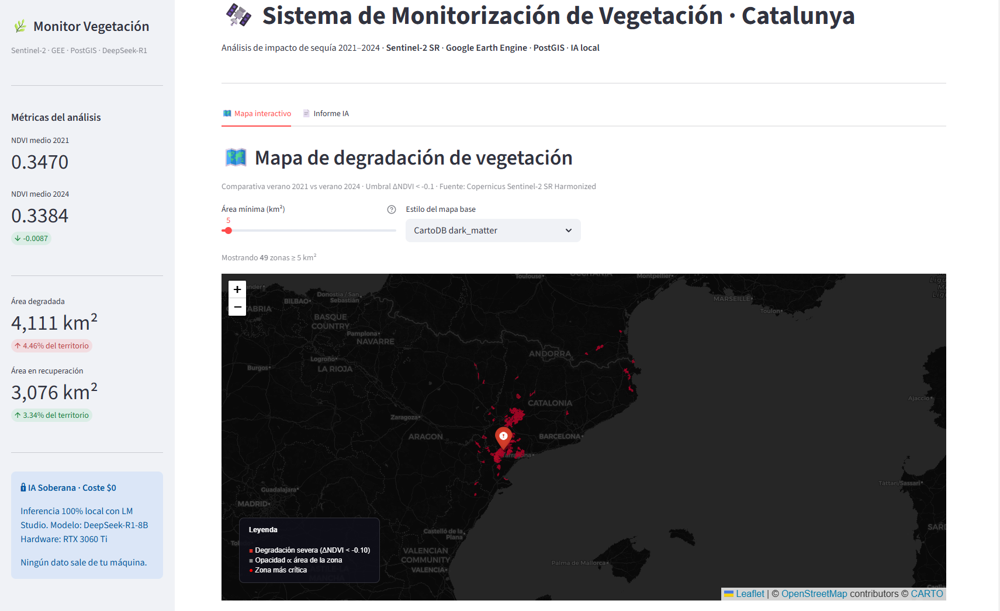
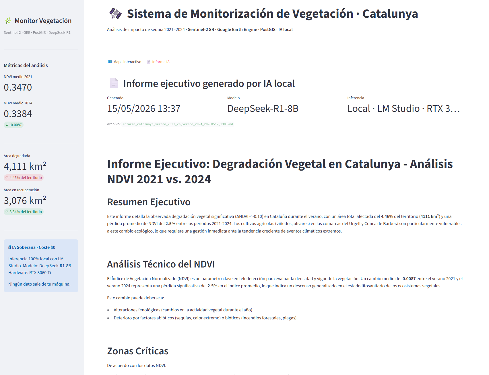
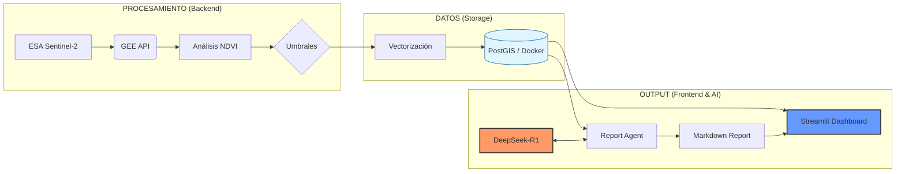
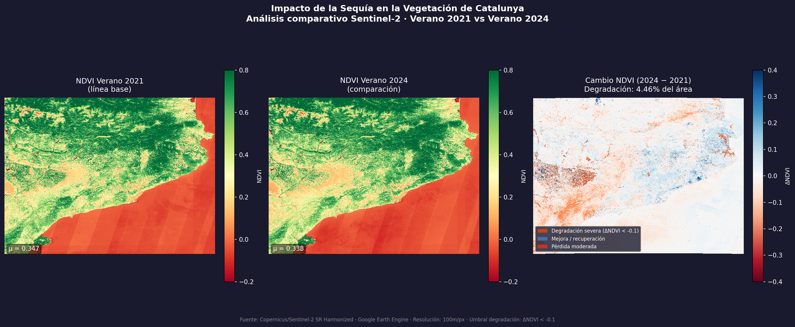
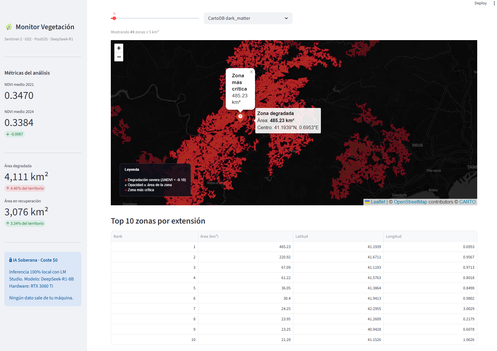

# 🛰️ SentinelWatch - Sistema de Monitorización de Vegetación con IA Soberana

> Pipeline end-to-end de teledetección satelital de imágenes Sentinel-2 crudas a informes ejecutivos en lenguaje natural, con **coste cero** e **inferencia 100% local**.


---

## Descripción del proyecto

**SentinelWatch** analiza el impacto de la sequía mediterránea en la vegetación de Catalunya comparando imágenes satelitales Sentinel-2 entre dos periodos temporales. El sistema detecta automáticamente zonas de degradación significativa, las almacena como geometrías espaciales en una base de datos PostGIS y genera informes ejecutivos en lenguaje natural usando un modelo de lenguaje que se ejecuta **completamente en local**.

**Caso de uso demostrado:** Comparativa verano 2021 vs verano 2024 sobre Catalunya, detectando 4.111 km² de degradación severa de vegetación (ΔNDVI < −0.10), equivalente al 4,46% del territorio.

<p align="center">
  
  
</p>

### ¿Por qué este proyecto es relevante para el sector aeroespacial?

- Trabaja con datos reales de la constelación **Copernicus/Sentinel-2** de la ESA.
- Implementa el índice de vegetación **NDVI** usado por agencias como ESA, NASA y Planet Labs.
- Demuestra dominio del stack completo: **adquisición → procesamiento → almacenamiento → comunicación**.
- Usa **IA Soberana** (inferencia local), un requisito creciente en proyectos de defensa y seguridad.

---

## Arquitectura del pipeline



---

## IA Soberana: inferencia local con LM Studio

Este proyecto implementa un patrón de **IA Soberana**: El modelo de lenguaje que genera los informes ejecutivos se ejecuta íntegramente en hardware local, sin enviar ningún dato a APIs de terceros (OpenAI, Anthropic, Google, etc.).

| Característica         | IA Soberana (este proyecto) | API Externa (OpenAI, etc.) |
|------------------------|----------------------------|---------------------------|
| Coste por informe      | **$0.00**                  | ~$0.02–0.10               |
| Privacidad de datos    | **Total** (local)          | Datos enviados a terceros |
| Disponibilidad         | **Sin internet requerido** | Depende de conectividad   |
| Latencia               | ~30–90s (RTX 3060 Ti)      | ~5–15s                    |
| Cumplimiento GDPR      | **Trivial**                | Requiere DPA              |

**Modelo usado:** DeepSeek-R1-8B (destilado del modelo de razonamiento DeepSeek-R1).
**Servidor:** LM Studio, compatible con la API de OpenAI, por lo que el código es 100% portable a cualquier proveedor si se desea escalar.

---

## Tecnologías

| Capa | Tecnología | Propósito |
|------|-----------|-----------|
| **Datos** | Google Earth Engine Python API | Acceso a imágenes Sentinel-2 SR |
| **Satélite** | Copernicus Sentinel-2 (ESA) | Imágenes multiespectrales 10m/px |
| **Procesamiento** | NumPy + Rasterio | Cálculo NDVI, análisis raster |
| **Visualización** | Matplotlib | Mapas de calor y comparativa |
| **Base de datos** | PostgreSQL 16 + PostGIS 3.4 | Almacenamiento de geometrías espaciales |
| **Contenedores** | Docker + Docker Compose | Orquestación del entorno |
| **IA local** | LM Studio + DeepSeek-R1-8B | Generación de informes (sin coste) |
| **Dashboard** | Streamlit + Folium | Visualización web interactiva |
| **Geometrías** | Shapely + GeoPandas | Manipulación de polígonos |

---

## Estructura del proyecto

```
sentinelwatch
├── app.py                  # Hito 5: Dashboard Streamlit
├── main.py                 # Hito 1: Orquestador GEE
├── config.py               # Configuración centralizada (AOI, fechas, umbrales)
├── gee_extractor.py        # Hito 1: Extracción y exportación Sentinel-2
├── analytics.py            # Hito 2: Análisis NDVI y visualización
├── ingest_to_db.py         # Hito 3: Vectorización e ingesta en PostGIS
├── report_agent.py         # Hito 4: Agente LLM → informe Markdown
├── docker-compose.yml      # Servicio PostGIS
├── requirements.txt
├── .env.example            # Plantilla de variables de entorno
├── test_gee_connection.py  # Script de diagnóstico de conexión a GEE
├── README.md               # Documentación principal (este archivo)
├── LICENSE.md              # Licencia MIT
├── assets/                 # RECURSOS DEL REPO (Imágenes para el README)
├── sql/
│   └── init.sql            # Schema de la base de datos PostGIS
└── data/                   # Archivos generados (algunos excluidos del repo)
    ├── verano_2021_ndvi.tif
    ├── verano_2024_ndvi.tif
    ├── ndvi_difference_2021_vs_2024.tif
    ├── analisis_catalunya.png
    ├── stats_summary.json
    ├── informe_catalunya_*.md
    └── .gitkeep            
```

---

## Guía de instalación paso a paso

### Prerequisitos

- Python 3.10 o superior.
- Docker Desktop instalado y corriendo.
- Cuenta de Google con acceso a [Google Earth Engine](https://earthengine.google.com) aprobado.
- Un proyecto en [Google Cloud Console](https://console.cloud.google.com) con la API de Earth Engine habilitada.
- *(Para el Hito 4)* [LM Studio](https://lmstudio.ai) con el modelo DeepSeek-R1-8B descargado.

### 1. Clonar el repositorio

```bash
git clone https://github.com/SergiiCB/sentinelwatch.git
cd sentinelwatch
```

### 2. Crear entorno virtual e instalar dependencias

Crear entorno virtual
```bash
python -m venv venv
```

*Windows*
```bash
venv\Scripts\activate
```

*Linux / macOS*
```bash
source venv/bin/activate
```

Instalar dependencias
```bash
pip install -r requirements.txt
```

### 3. Configurar variables de entorno

```bash
cp .env.example .env
```

Edita `.env` con tus valores:

```env
GEE_PROJECT_ID=tu-google-cloud-project-id

POSTGRES_DB=deforestation_db
POSTGRES_USER=geouser
POSTGRES_PASSWORD=tu_password_segura
POSTGRES_HOST=localhost
POSTGRES_PORT=5433

LM_STUDIO_URL=http://localhost:1234/v1
```

### 4. Autenticar Google Earth Engine

```bash
python -c "import ee; ee.Authenticate()"
```

Se abrirá el navegador. Acepta los permisos con tu cuenta Google.

### 5. Levantar la base de datos PostGIS

```bash
docker compose up -d
```

```bash
docker compose ps
```

> [!NOTE]
> Asegúrate de que el estado sea 'Up' o 'Healthy'

### 6. Diagnóstico de conexión (Recomendado)

Antes de procesar datos pesados, verifica que tu autenticación con Google Earth Engine es correcta:

```bash
python test_gee_connection.py
```

### 7. Ejecutar el pipeline completo

Hito 1: Extraer imágenes Sentinel-2 y calcular diferencia NDVI
```bash
python main.py
```

Hito 2: Análisis estadístico y mapa de calor

```bash
python analytics.py
```

Hito 3: Vectorizar e ingestar en PostGIS

```bash
python ingest_to_db.py
```

Hito 4: Generar informe con LLM local

> [!NOTE]
> Asegúrate de tener LM Studio corriendo con DeepSeek-R1-8B cargado

```bash
python report_agent.py
```

Hito 5: Lanzar el dashboard

```bash
streamlit run app.py
```

El dashboard estará disponible en `http://localhost:8501`.

```bash
http://localhost:8501
```
---

## Resultados: caso de estudio Catalunya 2021–2024

<p align="center">
  
</p>

### Métricas globales

| Métrica | Valor |
|---------|-------|
| NDVI medio verano 2021 | 0.3821 |
| NDVI medio verano 2024 | 0.3456 |
| Área total con degradación significativa | **4111 km²** |
| Porcentaje del territorio | **4.46%** |
| Cambio medio NDVI | -0.0087 (-2.5%) |
| Área en recuperación | **3076 km²** |
| Porcentaje del territorio | **3.34%** |
| Modelo de análisis | DeepSeek-R1-8B (Local) |

### Zona crítica destacada: Priorat (con afectación en Ribera d'Ebre y Terra Alta)

La zona más crítica identificada por el sistema se localiza en:

- **Coordenadas:** 41.1939°N, 0.6953°E
- **Área afectada:** 485.23 km²
- **Contexto ecológico:** Zona semiárida con viñedos, olivares y almendros, históricamente vulnerable a sequías prolongadas. La reducción de NDVI en esta comarca es consistente con los datos pluviométricos del periodo 2021-2024, que registró déficit hídrico acumulado superior al 30% respecto a la media histórica.

<p align="center">
  
</p>

Esta zona coincide con los reportes del [Servei Meteorològic de Catalunya](https://www.meteo.cat) sobre episodios de sequía prolongada en el interior de Tarragona durante 2023-2024.

Para más detalles, se puede revisar el informe completo en: [Informe](data/informe_catalunya_verano_2021_vs_verano_2024_20260512_1303.md)

---

## Cómo extender el proyecto

- **Nuevas regiones:** modifica `AOI` en `config.py` con las coordenadas de cualquier zona del mundo
- **Otros índices:** añade NDWI (agua), NBR (quemado) o EVI (vegetación mejorado) en `gee_extractor.py`
- **Alertas automáticas:** programa `main.py` con cron/Task Scheduler para monitorización continua
- **Otro modelo LLM:** cambia `LM_STUDIO_URL` y el nombre del modelo - el código es compatible con cualquier servidor OpenAI-compatible (Ollama, vLLM, etc.)

---

## Licencia

Este proyecto está bajo la [Licencia MIT](LICENSE.md). Consulta el archivo para más detalles.

---

## Autor

**Sergi Cózar Badia** *Data Scientist.*

<p align="left">
<a href="https://linkedin.com/in/sergicb" target="blank"></a>

<a href="https://github.com/SergiiCB" target="blank"></a>
</p>

Este proyecto forma parte de mi portfolio profesional en Ciencia de Datos con especialización en datos geoespaciales y sistemas de IA aplicada al sector aeroespacial y medioambiental.

---

*Datos satelitales: Copernicus/Sentinel-2, cortesía del programa Copernicus de la Unión Europea y la ESA.*